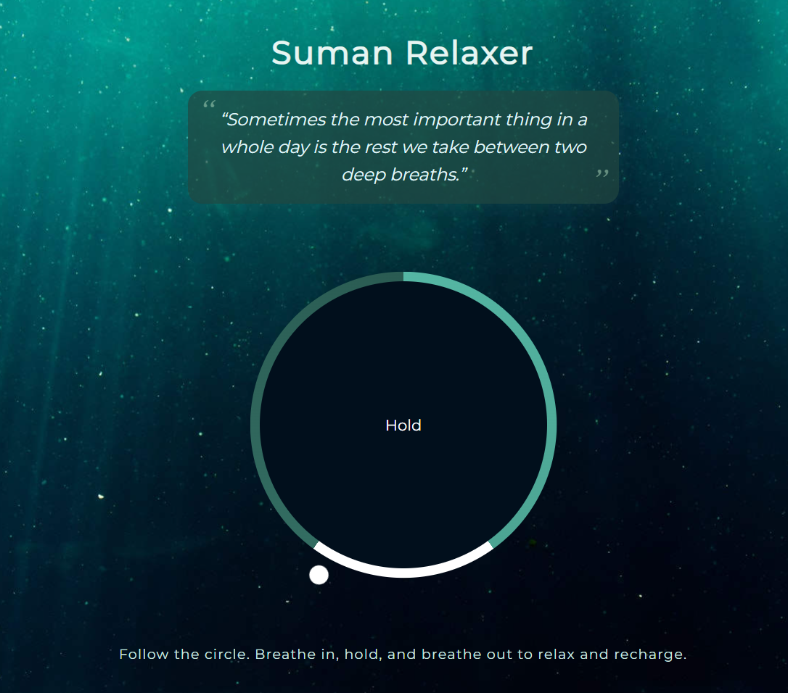

# 🌿 Suman Relaxer

A beautiful, minimal web app for mindful breathing and relaxation.

---

## ✨ Features

- **Guided Breathing Animation:**  
  Follow the animated circle to breathe in, hold, and breathe out—helping you relax and recharge.

- **Inspirational Quote:**  
  “Sometimes the most important thing in a whole day is the rest we take between two deep breaths.”

- **Soothing Visuals:**  
  Calming background and soft gradients for a peaceful experience.

- **Responsive Design:**  
  Looks great on desktop and mobile devices.

---

## 🛠️ Technologies Used

- HTML5
- CSS3 (with Google Fonts)
- JavaScript (ES6)

---

## 🖼️ Demo

> **Try it live:**  
> [GitHub Pages Demo Link](https://github.com/Sumanx16/Relaxer-App/)

---

## 📜 License

This project is open source and free to use for personal or educational purposes.

---

Breathe in. Hold. Breathe out.  
**Stay calm and fit with Suman Relaxer.**
